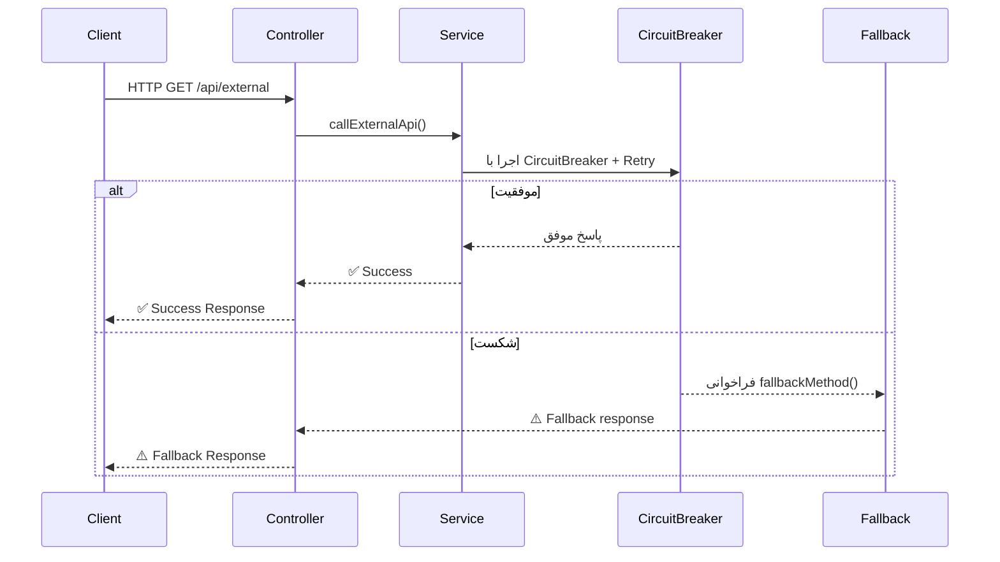

# 🚀 Spring Boot + Resilience4j (Circuit Breaker, Retry, Fallback, Callback)

[]()
[]()
[]()
[]()
[]()

این پروژه یک نمونه ساده از استفاده‌ی **Spring Boot** به همراه
**spring-cloud-starter-circuitbreaker-reactor-resilience4j** است که در آن:
- 🛡️ **Circuit Breaker** برای جلوگیری از شکست زنجیره‌ای سرویس‌ها
- 🔄 **Retry** برای تلاش دوباره در صورت شکست
- ⚠️ **Fallback** برای بازگرداندن پاسخ جایگزین
- 🔔 **Callback** برای واکنش به نتیجه‌ی عملیات

پیاده‌سازی شده است.

---

## ⚙️ وابستگی‌ها (pom.xml)

```xml
<dependencies>
    <!-- Spring Boot -->
    <dependency>
        <groupId>org.springframework.boot</groupId>
        <artifactId>spring-boot-starter</artifactId>
    </dependency>

    <!-- Resilience4j -->
    <dependency>
        <groupId>org.springframework.cloud</groupId>
        <artifactId>spring-cloud-starter-circuitbreaker-reactor-resilience4j</artifactId>
    </dependency>

    <!-- Web -->
    <dependency>
        <groupId>org.springframework.boot</groupId>
        <artifactId>spring-boot-starter-web</artifactId>
    </dependency>

    <!-- Test -->
    <dependency>
        <groupId>org.springframework.boot</groupId>
        <artifactId>spring-boot-starter-test</artifactId>
        <scope>test</scope>
    </dependency>
</dependencies>
```

---

## 📂 ساختار پروژه

```
demo-resilience4j/
 ├─ src/
 │   ├─ main/java/com/example/demo/
 │   │   ├─ DemoApplication.java       ← کلاس اصلی
 │   │   ├─ controller/ExternalController.java
 │   │   ├─ service/ExternalService.java
 │   │   └─ service/impl/ExternalServiceImpl.java
 │   │
 │   └─ test/java/com/example/demo/
 │       ├─ unit/
 │       │    ├─ ExternalServiceImplTest.java
 │       │    └─ ExternalControllerTest.java
 │       │
 │       └─ integration/
 │            ├─ ExternalServiceIntegrationTest.java
 │            └─ ExternalControllerIntegrationTest.java
 │
 └─ pom.xml
```

---

## 🔄 تفاوت Fallback و Callback

| ⭐ ویژگی        | 🛡️ Fallback                                      | 🔔 Callback                              |
|-----------------|-------------------------------------------------|-----------------------------------------|
| ⏰ زمان اجرا    | فقط وقتی خطا رخ بده                              | بعد از اتمام عملیات یا رویداد            |
| 🎯 هدف          | جلوگیری از شکست کل سیستم و برگرداندن پاسخ جایگزین | اجرای کدی که بعداً لازمه (مثلاً Async)   |
| 🛠️ کاربرد       | Resilience (پایداری در برابر خطا)                | Event-driven و Async Programming         |
| 🌍 مثال روزمره  | وقتی برق میره، ژنراتور روشن میشه (Plan B)        | وقتی غذا آماده شد، رستوران بهت زنگ میزنه |

---

## 🔎 جریان معماری (Mermaid Diagram)



---

## ⚙️ تنظیمات Resilience4j

```yaml
resilience4j:
  circuitbreaker:
    instances:
      externalService:
        registerHealthIndicator: true
        slidingWindowSize: 5
        minimumNumberOfCalls: 3
        failureRateThreshold: 60
        waitDurationInOpenState: 5s
        permittedNumberOfCallsInHalfOpenState: 2
```

📌 توضیح:  
- ۵ درخواست آخر مبنا هستند (sliding window = 5).  
- بعد از حداقل ۳ فراخوانی، درصد خطا حساب میشه.  
- اگر بیش از ۶۰٪ خطا بود → مدار باز (open).  
- بعد از ۵ ثانیه دوباره مدار نیمه‌باز میشه (half-open).  
- در حالت نیمه‌باز فقط ۲ درخواست اجازه عبور دارن.  

---

## ▶️ اجرای پروژه

```bash
mvn spring-boot:run
```

سپس:  
```bash
GET http://localhost:8080/api/call
```

نمونه خروجی:  
```
✅ External service success!
⚠️ Fallback: service unavailable (“Simulated failure in external service”)
```

---

## 🧪 تست‌ها (Unit + Integration)

### Unit Tests
- **ExternalServiceImplTest**  
  - تست موفقیت/شکست متد `call()`  
  - تست retry و fallback در `callExternalApiSync()`  
  - تست callback (Consumer صدا زده میشه)  
  - تست async (CompletableFuture + onSuccess/onError)

- **ExternalControllerTest**  
  - تست endpoint `/api/callSync` با MockMvc  
  - تست `/api/callAsync` و هندل async  
  - تست `/api/callback` با CompletableFuture

### Integration Tests
- **ExternalServiceIntegrationTest**  
  - اجرای واقعی CircuitBreaker روی سرویس  
  - تست حالات success و fallback

- **ExternalControllerIntegrationTest**  
  - اجرای واقعی Controller + Service + Resilience4j  
  - تست endpointها با MockMvc  

---

## 📌 اجرای تست‌ها
```bash
./mvnw test
```

---

## 📜 License
MIT License

---
---

## 👩‍💻 تست Endpoint‌ها با curl

### 🟢 1. فراخوانی Sync با CircuitBreaker/Retry
**URL:** `GET /api/callSync`  
**توضیح:** اجرای همزمان (SYNC) با Resilience4j CircuitBreaker + Retry.

```bash
curl -v http://localhost:8080/api/callSync
✅ Success on attempt 1
✅ Success on attempt 2
⚠️ Fallback response because: ❌ External API failed on attempt 1
⚠️ Fallback response because: ❌ CircuitBreaker 'externalService' is OPEN and does not permit further calls


curl -v http://localhost:8080/api/callAsync
✅ Processed asynchronously: Hello External API
✅ Processed asynchronously: Data from attempt 2
❌ Async error handled: java.util.concurrent.TimeoutException
❌ Async error handled: Simulated failure in async process


curl -v http://localhost:8080/api/callback

✅ Callback finished: result=OK
✅ Callback finished: Service responded successfully
⚠️ Callback fallback: service unavailable
⚠️ Callback fallback: Simulated callback failure

